# LegalOps - Legal Opinion SaaS Platform

A **multi-tenant SaaS platform** for law firms in India that serve as panel advocates for banks. The platform digitizes the legal opinion workflow — from document submission and AI-powered extraction to opinion generation, review, and issuance.

## Key Capabilities

- **Multi-Tenant Architecture** — Each law firm is an isolated tenant with its own branding, users, and data
- **AI/LLM-Powered** — Pluggable LLM providers (OpenAI GPT-4, Anthropic Claude, Google Gemini) for draft opinion generation and document translation
- **Multilingual Document Processing** — OCR + automatic language detection + translation for 11 Indian regional languages
- **Configurable Opinion Workflow** — Draft → Review → Approve → Issue with role-based access control
- **Bank-Specific Templates** — Each bank client has its own opinion format template
- **Email Notifications** — Configurable per-bank notifications to bank clients and end customers
- **Audit Trail** — Full compliance logging of all actions with old/new value tracking

---

## Architecture Overview

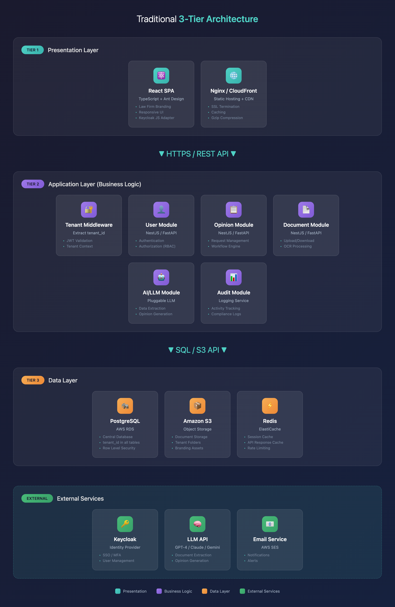

### Tech Stack

| Layer | Technology | Purpose |
|---|---|---|
| **Frontend** | React 18 + TypeScript + Vite | Single Page Application |
| **UI Library** | Ant Design 5 | Component library |
| **State** | Zustand + TanStack React Query | Client & server state |
| **Backend** | NestJS 10 + TypeScript | REST API, business logic |
| **ORM** | TypeORM | Database abstraction |
| **Database** | PostgreSQL 16 | Relational data with tenant isolation |
| **Cache** | Redis 7 | Session and API caching |
| **Auth** | Keycloak 24 | SSO, RBAC, JWT (PKCE + JWKS) |
| **AI/LLM** | OpenAI / Anthropic / Google | Opinion generation, translation |
| **OCR** | Tesseract + Sarvam AI | Document text extraction |
| **Email** | Nodemailer (SMTP / SES) | Notifications |
| **Storage** | Local / NFS / Amazon S3 | Document storage (pluggable) |
| **Containers** | Docker + Docker Compose | Local development |
| **Orchestration** | Kubernetes (k3s / EKS) | Production deployment |

---

## Multi-Tenancy Model

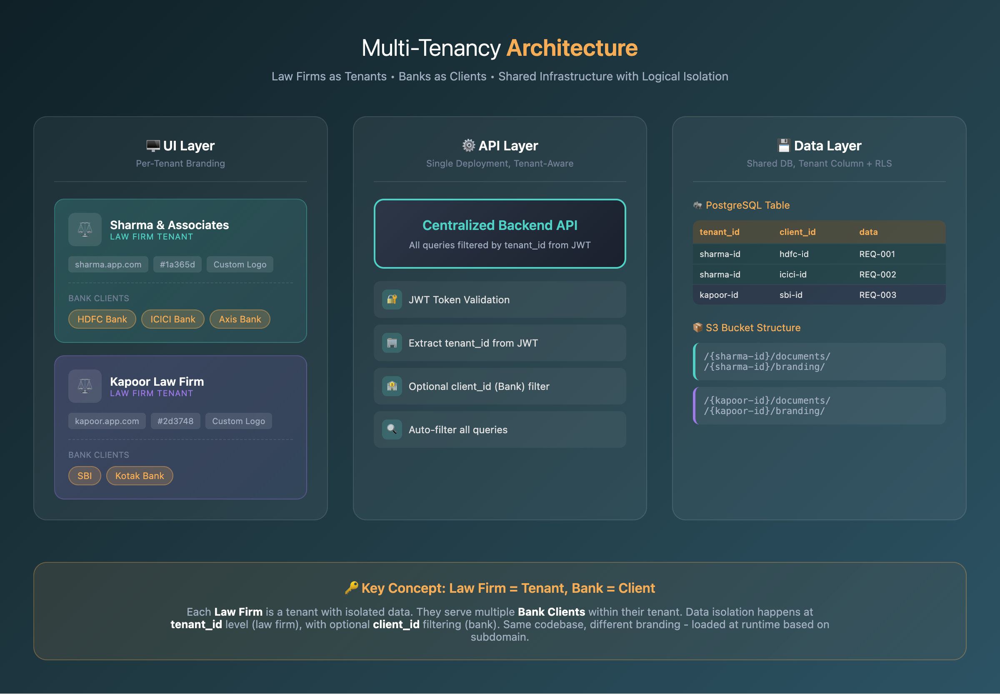

| Concept | Entity | Description |
|---|---|---|
| **Tenant** | Law Firm | e.g. "Sharma & Associates" — has own branding, users, data |
| **Client** | Bank | e.g. "HDFC Bank" — served by the law firm tenant |
| **End Customer** | Borrower | Loan applicant referred by the bank to the law firm |

- **Shared database, shared schema** with `tenant_id` column on all tables
- **Single Keycloak realm** — one pair of clients for all firms
- JWT `tenant_id` claim provides tenant isolation at the API layer

---

## Authentication & RBAC

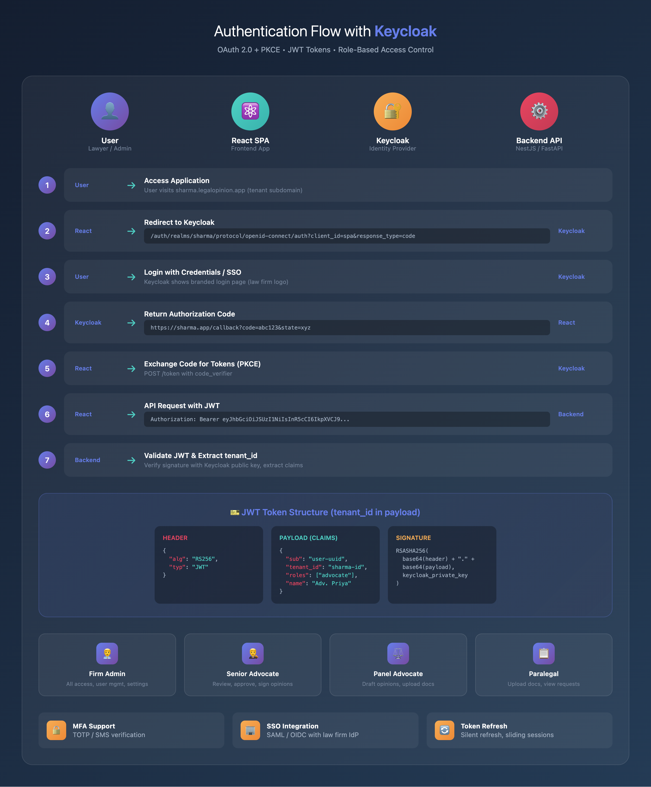

### Keycloak Integration
- **Realm**: `legal-opinion-saas`
- **SPA Client**: `legal-opinion-web` (public, PKCE S256)
- **API Client**: `legal-opinion-api` (bearer-only)
- **Tenant Mapping**: User attribute `tenant_id` → JWT claim via protocol mapper
- **Identity Brokering**: Supports SSO with firm's IdP (Azure AD, Okta, etc.)

### Roles & Permissions

| Role | Opinion Requests | Documents | Opinions | Admin |
|---|---|---|---|---|
| **Super Admin** | All actions | All actions | All actions | Full platform access: tenants, users, settings, all features |
| **Firm Admin** | Create, assign, delete | Upload, delete | All actions, issue | Users, settings, bank clients |
| **Senior Advocate** | Create, assign | Upload | Draft, review, approve, issue | - |
| **Panel Advocate** | Create | Upload | Draft, submit | - |
| **Paralegal** | Create | Upload | View only | - |
| **Branding Manager** | - | - | - | Branding only |

---

## AI / LLM Integration

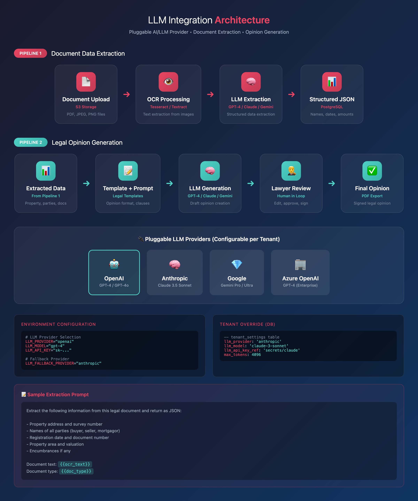

### Document Processing Pipeline

```
Upload → OCR (Tesseract) → Language Detection (LLM)
                                    |
                    [English] ------+------ [Regional Language]
                        |                        |
                        v                        v
                   Sarvam AI              LLM Translation → English
                   Extraction                    |
                        |                        v
                        v                   Sarvam AI Extraction
                   Persist Data                  |
                        |                        v
                        +-------> Persist Data (original + translated + extracted)
```

**Supported Regional Languages**: Hindi, Tamil, Telugu, Kannada, Malayalam, Marathi, Gujarati, Bengali, Odia, Punjabi, Assamese

### Opinion Generation

The AI generates structured draft opinions by combining:
1. **Extracted document data** (property details, parties, dates, amounts)
2. **Bank-specific opinion template** (configured per bank client)
3. **Loan and property context** (type, amount, location)

Output fields: Summary Findings, Title Chain Analysis, Encumbrance Analysis, Risk Observations, Final Opinion, Recommendation (Positive/Negative/Conditional), Conditions.

### Pluggable LLM Providers

| Provider | Config Value | Model Examples |
|---|---|---|
| OpenAI | `openai` | `gpt-4`, `gpt-4-turbo` |
| Anthropic | `anthropic` | `claude-sonnet-4-20250514`, `claude-opus-4-0-20250514` |
| Google | `google` | `gemini-pro`, `gemini-1.5-pro` |
| Sarvam AI | `sarvam` | Sarvam AI chat models |

Set via `LLM_PROVIDER` and `LLM_MODEL` environment variables.

---

## User Workflows

Detailed user workflows with screenshots are documented in **[docs/workflows.md](docs/workflows.md)**.

### Quick Overview

| # | Workflow | Screenshot |
|---|---|---|
| 0 | [Tenant Onboarding (Self-Service)](docs/workflows.md#0-tenant-onboarding-self-service-registration) | Public `/register` page |
| 1 | [Login & Tenant Branding](docs/workflows.md#2-login--tenant-branding-workflow) | 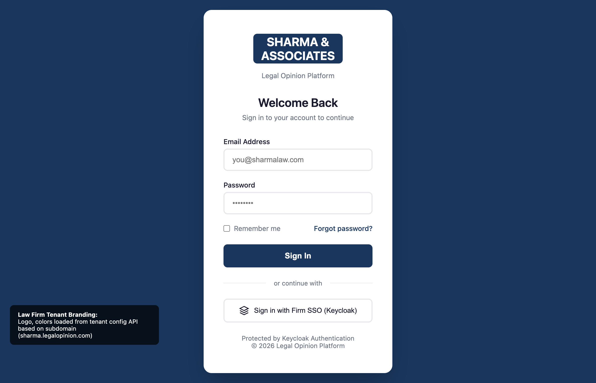 |
| 2 | [Dashboard](docs/workflows.md#3-dashboard-workflow) | 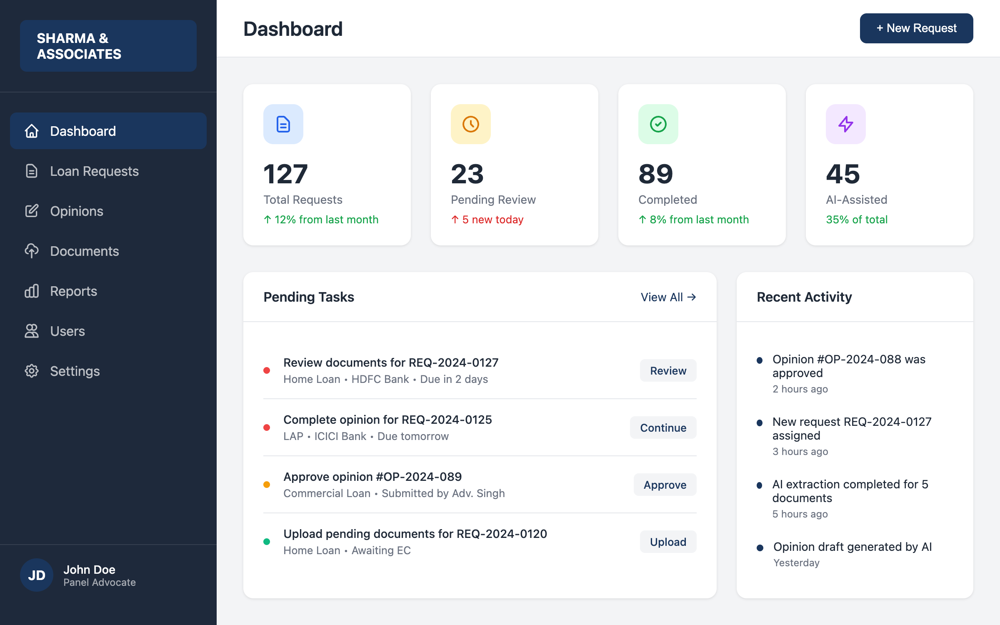 |
| 3 | [Opinion Request Management](docs/workflows.md#4-opinion-request-management) | 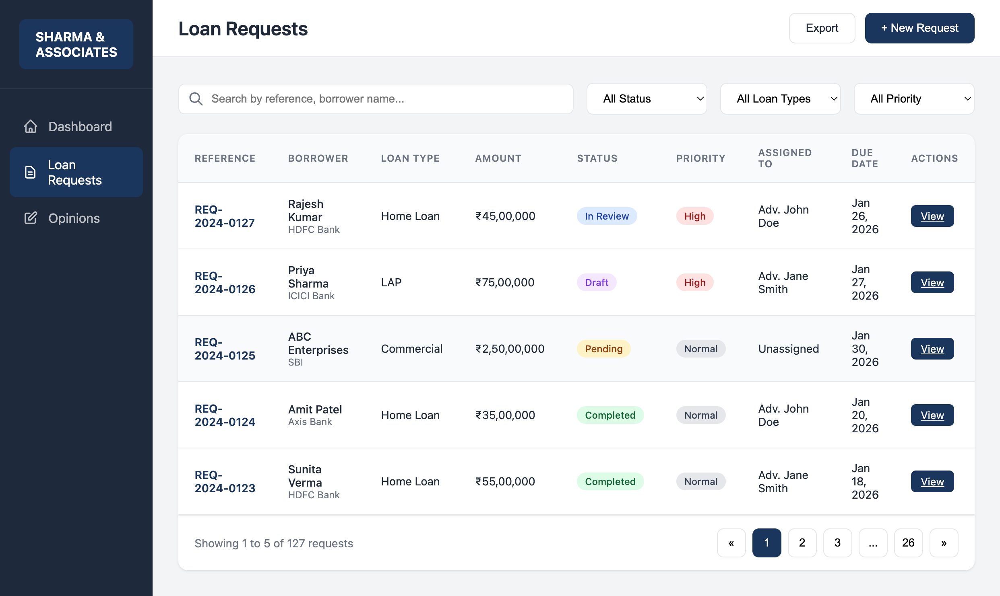 |
| 4 | [Request Detail & Documents](docs/workflows.md#4b-opinion-request-detail) | 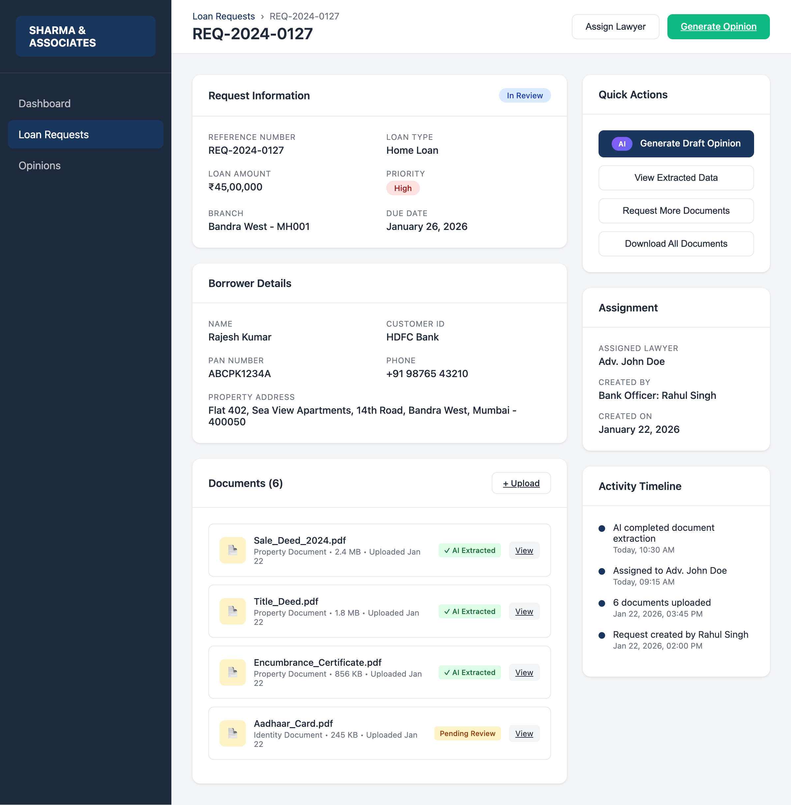 |
| 5 | [Document Upload & Processing](docs/workflows.md#5-document-management-workflow) | 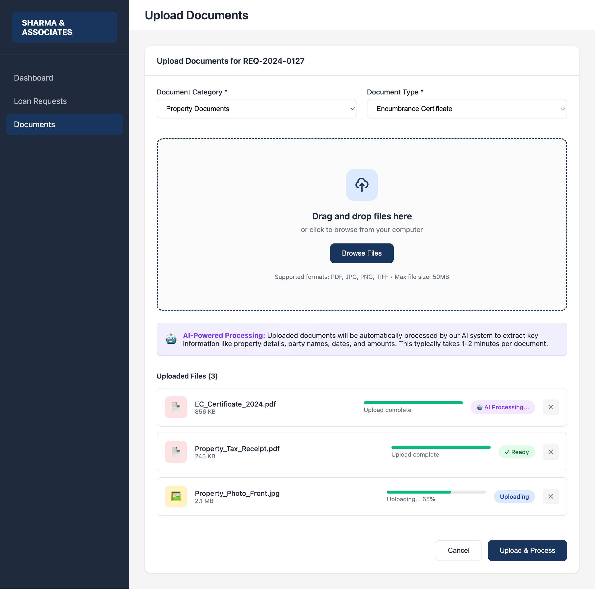 |
| 6 | [Document Viewer](docs/workflows.md#5b-document-viewer) | 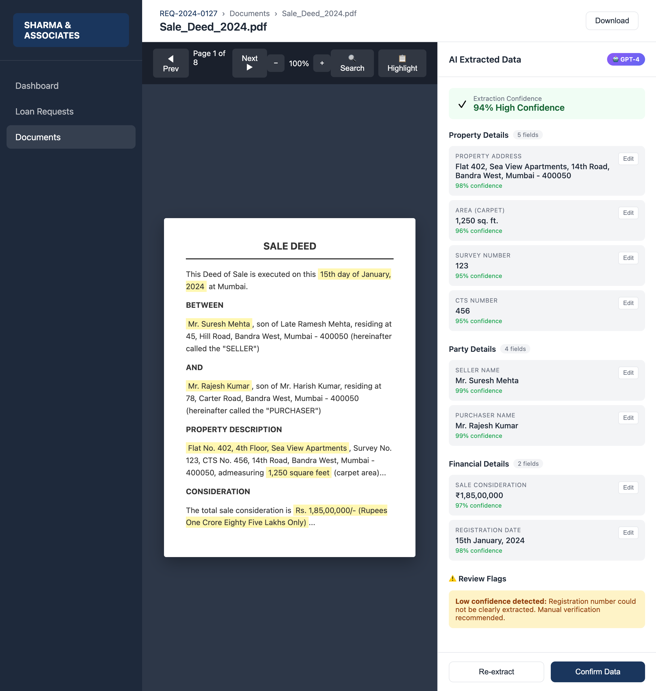 |
| 7 | [Opinion Editor & AI Draft](docs/workflows.md#6-opinion-drafting--ai-generation-workflow) | 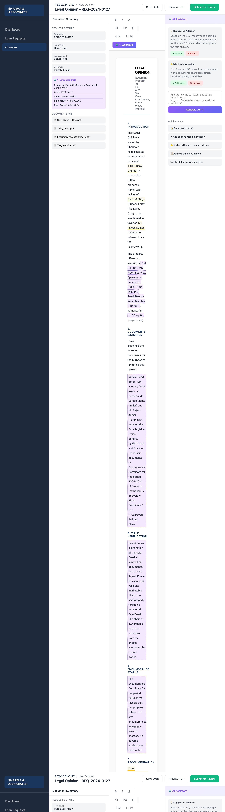 |
| 8 | [User Management](docs/workflows.md#7-user-management-workflow-firm-admin) | 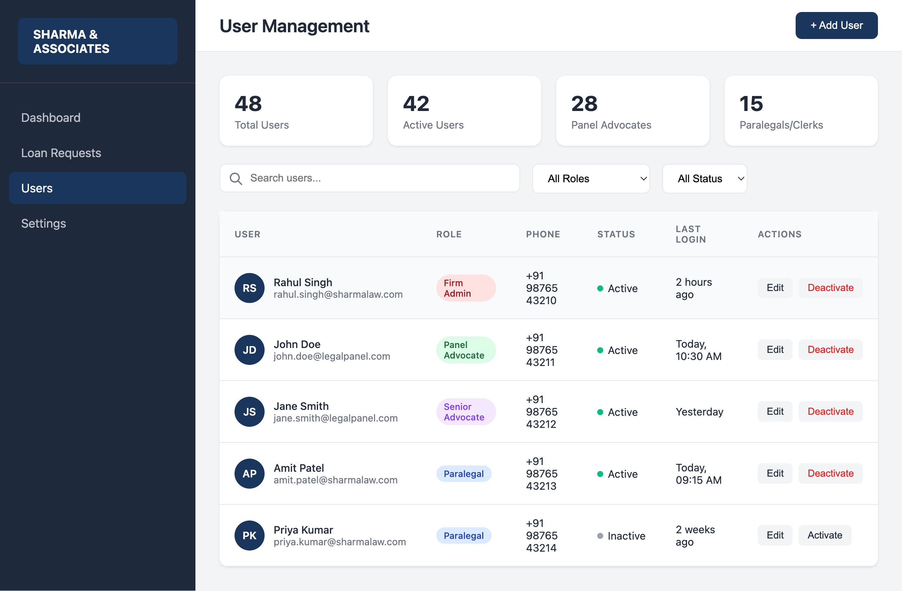 |
| 9 | [Tenant Settings & AI Config](docs/workflows.md#9-tenant-settings--ai-configuration) | 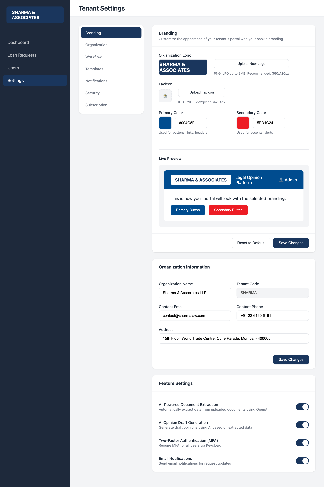 |
| 10 | [Reports & Analytics](docs/workflows.md#10-reports--analytics) | 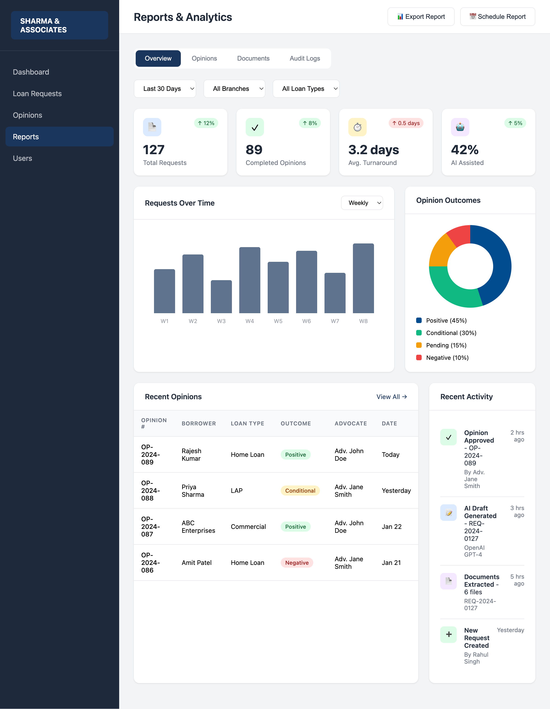 |

### Core Workflow: Opinion Request Lifecycle

```
Borrower → Bank referral → Law Firm
    |
    v
[Paralegal] Create Request → Upload Documents
    |
    v
[System] OCR → Detect Language → Translate → Extract Data
    |
    v
[Advocate] Generate AI Draft → Review & Edit → Submit
    |
    v
[Senior Advocate] Review → Approve (or Request Changes)
    |
    v
[Firm Admin] Issue Final Opinion
    |
    v
[System] Notify Bank + End Customer (configurable)
```

---

## Data Model

### Entity Relationship

```
Tenant (Law Firm)
  ├── Users
  ├── BankClients
  │     ├── EndCustomers (Borrowers)
  │     └── OpinionTemplates
  ├── OpinionRequests
  │     ├── Documents
  │     └── Opinions
  └── AuditLogs
```

### Key Entities

| Entity | Key Fields |
|---|---|
| **Tenant** | code, slug, name, branding (logo, colors), settings (AI config), subscription |
| **User** | keycloakId, email, role, tenantId |
| **BankClient** | code, name, branch, notification settings, default template |
| **EndCustomer** | name, email, PAN, Aadhaar, linked to bank client |
| **OpinionTemplate** | name, templateContent (JSON), loanType, per bank client |
| **OpinionRequest** | referenceNumber, loanType, amount, property, status, assigned lawyer |
| **Document** | filename, storagePath, documentType, OCR data, translation data, extracted data |
| **Opinion** | sections (summary, title chain, encumbrance, risk, final), recommendation, conditions, AI generated flag |
| **AuditLog** | entityType, entityId, action, oldValues, newValues, userId, ipAddress |

---

## Repository Structure

```
legalops-app/
├── backend/                          # NestJS REST API
│   └── src/
│       ├── ai/                       # AI/LLM module (providers, prompts, translation)
│       ├── audit-logs/               # Audit logging service
│       ├── auth/                     # Keycloak JWT auth, RBAC guards
│       ├── bank-clients/             # Bank client CRUD
│       ├── config/                   # App configuration
│       ├── dashboard/                # Dashboard stats endpoint
│       ├── database/                 # TypeORM setup, dev seed
│       ├── document-pipeline/        # OCR → Translation → Extraction pipeline
│       ├── documents/                # Document upload & management
│       ├── end-customers/            # End customer CRUD
│       ├── notifications/            # Email notification engine
│       ├── opinion-requests/         # Opinion request lifecycle
│       ├── opinion-templates/        # Bank-specific templates
│       ├── opinions/                 # Opinion drafting & review workflow
│       ├── reports/                  # TAT, workload, compliance reports
│       ├── storage/                  # Pluggable storage (local/NFS/S3)
│       ├── tenancy/                  # Multi-tenant middleware
│       ├── tenants/                  # Tenant management & branding
│       └── users/                    # User CRUD
├── frontend/                         # React SPA
│   └── src/
│       ├── auth/                     # Keycloak client config
│       ├── components/               # Layout, DocumentViewer
│       ├── lib/                      # Role helpers
│       ├── pages/
│       │   ├── admin/                # Users, Bank Clients, Templates, Settings
│       │   ├── auth/                 # Welcome/Login
│       │   ├── dashboard/            # Dashboard with stat widgets
│       │   ├── opinion-requests/     # List + Detail pages
│       │   ├── opinions/             # Opinion editor with AI draft
│       │   └── reports/              # Audit logs, TAT, workload, compliance
│       ├── services/                 # Axios API client
│       └── store/                    # Zustand stores (auth, branding)
├── deployment/
│   ├── docker/                       # Docker Compose + init scripts
│   ├── keycloak/                     # Realm JSON (roles, clients, demo user)
│   └── k8s/
│       ├── local/                    # K8s manifests for local k3s
│       └── eks/                      # K8s manifests for AWS EKS
└── docs/
    ├── images/                       # Architecture diagrams & UI mockups
    ├── workflows.md                  # Detailed user workflow documentation
    ├── architecture.md               # Architecture notes
    ├── env-matrix.md                 # Environment variable reference
    └── local-runbook.md              # Local K8s deployment guide
```

---

## API Endpoints

### Opinion Requests
| Method | Path | Roles |
|---|---|---|
| `POST` | `/api/v1/opinion-requests` | firm_admin, senior_advocate, paralegal |
| `GET` | `/api/v1/opinion-requests` | All authenticated |
| `GET` | `/api/v1/opinion-requests/:id` | All authenticated |
| `PATCH` | `/api/v1/opinion-requests/:id/status` | firm_admin, senior_advocate |
| `PATCH` | `/api/v1/opinion-requests/:id/assign` | firm_admin, senior_advocate |
| `DELETE` | `/api/v1/opinion-requests/:id` | firm_admin, senior_advocate |

### Documents
| Method | Path | Roles |
|---|---|---|
| `POST` | `/api/v1/opinion-requests/:id/documents` | All authenticated |
| `GET` | `/api/v1/opinion-requests/:id/documents` | All authenticated |
| `GET` | `/api/v1/opinion-requests/:id/documents/:docId/signed-url` | All authenticated |
| `DELETE` | `/api/v1/opinion-requests/:id/documents/:docId` | firm_admin, senior_advocate |

### Opinions
| Method | Path | Roles |
|---|---|---|
| `POST` | `/api/v1/opinion-requests/:id/opinions` | advocate, senior_advocate, firm_admin |
| `GET` | `/api/v1/opinion-requests/:id/opinions` | All authenticated |
| `PATCH` | `/api/v1/opinion-requests/:id/opinions/:oid` | advocate, senior_advocate, firm_admin |
| `POST` | `/api/v1/opinion-requests/:id/opinions/:oid/generate-draft` | advocate, senior_advocate, firm_admin |
| `PATCH` | `/api/v1/opinion-requests/:id/opinions/:oid/submit` | advocate, senior_advocate |
| `PATCH` | `/api/v1/opinion-requests/:id/opinions/:oid/approve` | senior_advocate, firm_admin |
| `PATCH` | `/api/v1/opinion-requests/:id/opinions/:oid/issue` | senior_advocate, firm_admin |
| `POST` | `/api/v1/opinion-requests/:id/opinions/:oid/comments` | senior_advocate, firm_admin |

### Admin
| Method | Path | Roles |
|---|---|---|
| `GET/POST/PATCH/DELETE` | `/api/v1/bank-clients[/:id]` | firm_admin (write), all (read) |
| `GET/POST/PATCH/DELETE` | `/api/v1/end-customers[/:id]` | firm_admin (write), all (read) |
| `GET/POST/PATCH/DELETE` | `/api/v1/opinion-templates[/:id]` | firm_admin (write), all (read) |
| `GET/POST/PATCH` | `/api/v1/users[/:id]` | firm_admin |
| `GET/POST/PATCH` | `/api/v1/tenants[/:id]` | super_admin |

### Dashboard & Reports
| Method | Path | Roles |
|---|---|---|
| `GET` | `/api/v1/dashboard/stats` | All authenticated |
| `GET` | `/api/v1/reports/audit-logs` | All authenticated |
| `GET` | `/api/v1/reports/tat` | firm_admin, senior_advocate |
| `GET` | `/api/v1/reports/workload` | firm_admin, senior_advocate |
| `GET` | `/api/v1/reports/compliance` | firm_admin, senior_advocate |

### Public (No Auth)
| Method | Path | Purpose |
|---|---|---|
| `GET` | `/api/v1/public/tenants/config?code=X` | Tenant branding for login page |
| `POST` | `/api/v1/public/register` | Self-service tenant registration |

---

## Deployment

### Deployment Architecture

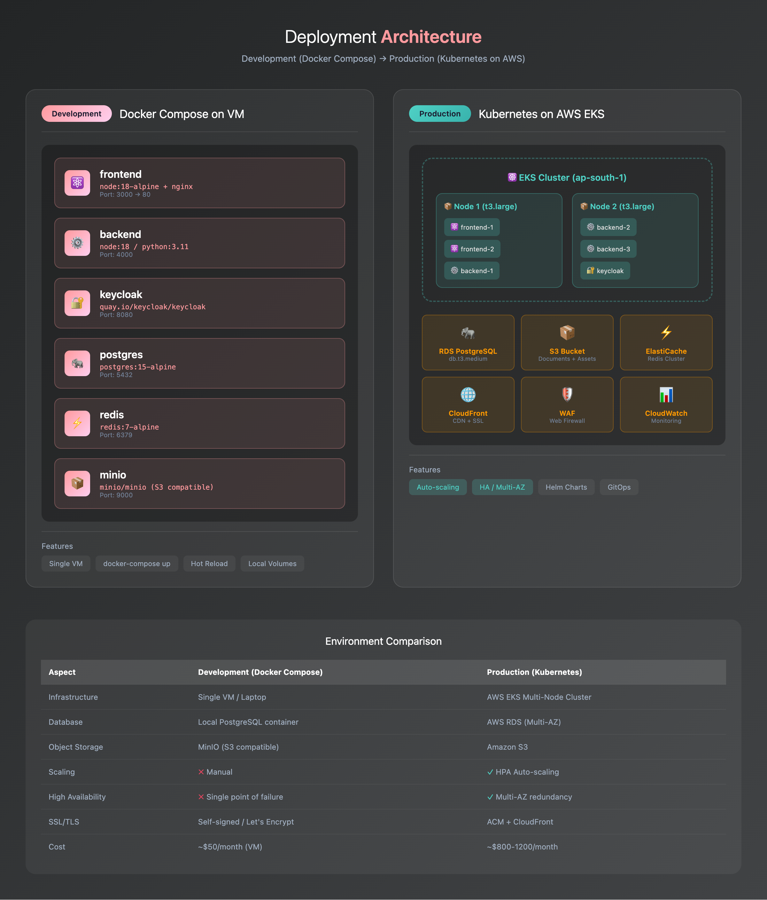

### Local Development (Docker Compose)

```bash
cd deployment/docker
cp .env.example .env
# Edit .env: set LLM_API_KEY, SMTP_* if needed
docker compose up --build
```

| Service | URL |
|---|---|
| Frontend | http://localhost |
| Backend API / Swagger | http://localhost:3000/api/docs |
| Keycloak Admin | http://localhost:8080/auth |

**Demo credentials**: `firmadmin` / `Legalops@123`

### Kubernetes (Local k3s)

```bash
kubectl apply -k deployment/k8s/local/
```

See [docs/local-runbook.md](docs/local-runbook.md) for detailed instructions.

### Kubernetes (AWS EKS)

```bash
kubectl apply -k deployment/k8s/eks/
```

Uses: S3 (IRSA), RDS, ElastiCache, ALB Ingress, ACM certificates.

---

## Configuration

### Backend Environment Variables

| Variable | Default | Description |
|---|---|---|
| `DB_HOST` | `localhost` | PostgreSQL host |
| `DB_NAME` | `legalops` | Database name |
| `DB_USER` | `legalops` | Database user |
| `DB_PASSWORD` | - | Database password |
| `REDIS_HOST` | `localhost` | Redis host |
| `KEYCLOAK_URL` | `http://localhost:8080/auth` | Keycloak base URL |
| `KEYCLOAK_REALM` | `legal-opinion-saas` | Keycloak realm |
| `KEYCLOAK_ADMIN_USER` | `admin` | Keycloak admin username (for onboarding) |
| `KEYCLOAK_ADMIN_PASSWORD` | - | Keycloak admin password (for onboarding) |
| `STORAGE_DRIVER` | `local` | `local` / `nfs` / `s3` |
| `LLM_PROVIDER` | `openai` | `openai` / `anthropic` / `google` |
| `LLM_API_KEY` | - | API key for LLM provider |
| `LLM_MODEL` | `gpt-4` | Model identifier |
| `SMTP_HOST` | `localhost` | SMTP server for notifications |
| `SMTP_FROM` | `noreply@legalops.local` | Sender email address |
| `SARVAM_API_KEY` | - | Sarvam AI API key |

Full reference: [docs/env-matrix.md](docs/env-matrix.md)

### Frontend Environment Variables

| Variable | Default | Description |
|---|---|---|
| `VITE_API_BASE_URL` | `` | Backend API URL |
| `VITE_KEYCLOAK_URL` | `{window.origin}/auth` | Keycloak URL |
| `VITE_KEYCLOAK_REALM` | `legal-opinion-saas` | Keycloak realm |
| `VITE_KEYCLOAK_CLIENT_ID` | `legal-opinion-web` | Keycloak SPA client |
| `VITE_DEFAULT_TENANT_CODE` | - | Default firm code for branding |

---

## Keycloak Setup

### One Realm, Many Firms

- **Single realm** (`legal-opinion-saas`) for the entire platform
- New law firm = new tenant row + Keycloak users with `tenant_id` attribute
- No per-firm realms or clients needed

### Demo User (Development)

The realm import at `deployment/keycloak/legal-opinion-saas-realm.json` includes:
- User: `firmadmin` / `Legalops@123`
- Role: `firm_admin`
- Tenant: `11111111-1111-1111-1111-111111111111` (Demo Law Firm)

### Adding a New Firm

**Self-Service (Recommended):**
1. Navigate to `/register` on the platform
2. Fill in firm details (name, code, admin email)
3. System automatically creates tenant + Keycloak user + sends credentials email
4. Firm admin logs in, changes password, and configures branding

**Manual (Super Admin):**
1. Create a `tenants` row via super_admin API
2. Create Keycloak users with the tenant's UUID as their `tenant_id` attribute
3. Assign appropriate realm roles (`firm_admin`, `senior_advocate`, etc.)
4. Configure branding via the Tenant Settings page

---

## License

Proprietary - PLR Technologies
